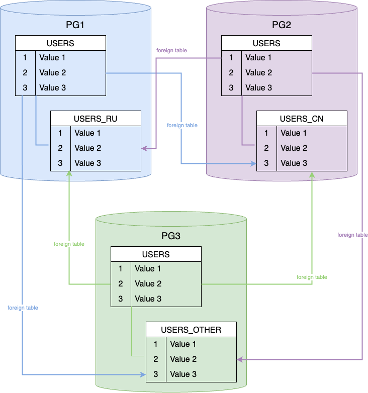

# Шардирование в PostgreSQL встроенными средствами Foreign Data Wrapper

Предположим, что мы хотим сделать шардирование пользователей по странам.

У нас есть 3 сервера. На первом сервер будут данные пользователей из России, на втором из Китая и на третьем из других стран.



Запрос можно делать к любому из трех серверов, вернутся данные все пользователей, но храниться они будут на разных серверах.

# Настройки Postgres FDW

На всех трех серверах для начала нужно выполнить:

1. Используйте существующую роль на сервере или создайте нового пользователя и предоставьте ему соответствующие права. Например:

```sql
CREATE ROLE user1 WITH PASSWORD 'password' LOGIN;

GRANT SELECT, INSERT, UPDATE, DELETE ON ALL TABLES IN SCHEMA public TO user1;

GRANT EXECUTE ON ALL FUNCTIONS IN SCHEMA public TO user1;
```

2. Выполните команду CREATE EXTENSION на локальном сервере, чтобы использовать обёртку postgres_fdw:

```sql
CREATE EXTENSION postgres_fdw;
```

# Настройки партиционирования и создание таблиц

## Настройки первого сервера

Далее на первом серерве создаем два сервера и маппинг для ролей:

```sql
CREATE SERVER pg2 FOREIGN DATA WRAPPER postgres_fdw OPTIONS (host 'pg2', port '5432', dbname 'postgres');
CREATE SERVER pg3 FOREIGN DATA WRAPPER postgres_fdw OPTIONS (host 'pg3', port '5432', dbname 'postgres');

CREATE USER MAPPING FOR postgres SERVER pg2 OPTIONS (user 'postgres', password 'example');
CREATE USER MAPPING FOR postgres SERVER pg3 OPTIONS (user 'postgres', password 'example');
```

Затем создаем основную партиционированную таблицу:

```sql
CREATE TABLE users (
  id SERIAL,
  name VARCHAR(100) NOT NULL,
  COUNTRY varchar(2) not null default 'RU'
) PARTITION BY LIST(COUNTRY);
```

Добавляем локальную партицию для пользователей из России:

```sql
CREATE TABLE users_ru
PARTITION OF users FOR VALUES IN ('RU');
```

Добавляем удаленную партицию на втором сервере для пользователей из Китая:

```sql
CREATE FOREIGN TABLE users_cn
PARTITION OF users FOR VALUES IN ('CN')
SERVER pg2;
```

Добавляем удаленную партицию на третьем сервере для остальных пользователей:

```sql
CREATE FOREIGN TABLE users_other
PARTITION OF users DEFAULT
SERVER pg3;
```

На этом настройки первого сервера завершены.

## Настройки второго сервера

Далее на втором серерве создаем два сервера и маппинг для ролей:

```sql
CREATE SERVER pg1 FOREIGN DATA WRAPPER postgres_fdw OPTIONS (host 'pg1', port '5432', dbname 'postgres');
CREATE SERVER pg3 FOREIGN DATA WRAPPER postgres_fdw OPTIONS (host 'pg3', port '5432', dbname 'postgres');

CREATE USER MAPPING FOR postgres SERVER pg1 OPTIONS (user 'postgres', password 'example');
CREATE USER MAPPING FOR postgres SERVER pg3 OPTIONS (user 'postgres', password 'example');
```

Затем создаем основную партиционированную таблицу:

```sql
CREATE TABLE users (
  id SERIAL,
  name VARCHAR(100) NOT NULL,
  COUNTRY varchar(2) not null default 'RU'
) PARTITION BY LIST(COUNTRY);
```

Добавляем локальную партицию для пользователей из Китая:

```sql
CREATE TABLE users_cn
PARTITION OF users FOR VALUES IN ('CN');
```

Добавляем удаленную партицию на первом сервере для пользователей из России:

```sql
CREATE FOREIGN TABLE users_ru
PARTITION OF users FOR VALUES IN ('RU')
SERVER pg1;
```

Добавляем удаленную партицию на третьем сервере для остальных пользователей:

```sql
CREATE FOREIGN TABLE users_other
PARTITION OF users DEFAULT
SERVER pg3;
```

На этом настройки второго сервера завершены.


## Настройки третьего сервера

Далее на третьем серерве создаем два сервера и маппинг для ролей:

```sql
CREATE SERVER pg2 FOREIGN DATA WRAPPER postgres_fdw OPTIONS (host 'pg2', port '5432', dbname 'postgres');
CREATE SERVER pg1 FOREIGN DATA WRAPPER postgres_fdw OPTIONS (host 'pg1', port '5432', dbname 'postgres');

CREATE USER MAPPING FOR postgres SERVER pg2 OPTIONS (user 'postgres', password 'example');
CREATE USER MAPPING FOR postgres SERVER pg1 OPTIONS (user 'postgres', password 'example');
```

Затем создаем основную партиционированную таблицу:

```sql
CREATE TABLE users (
  id SERIAL,
  name VARCHAR(100) NOT NULL,
  COUNTRY varchar(2) not null default 'RU'
) PARTITION BY LIST(COUNTRY);
```

Добавляем локальную партицию для прочих пользователей:

```sql
CREATE TABLE users_other
PARTITION OF users DEFAULT;
```

Добавляем удаленную партицию на втором сервере для пользователей из Китая:

```sql
CREATE FOREIGN TABLE users_cn
PARTITION OF users FOR VALUES IN ('CN')
SERVER pg2;
```

Добавляем удаленную партицию на первом сервере для пользователей из России:

```sql
CREATE FOREIGN TABLE users_ru
PARTITION OF users FOR VALUES IN ('RU')
SERVER pg1;
```

На этом настройки третьего сервера завершены.

# Работа с данными

Вставим на первом сервере нескольких пользователей из разных стран:

```sql
insert into users (name, COUNTRY)
values ('Ivan', 'RU'),
       ('Van I', 'CN'),
       ('Tom', 'US'),
       ('William', 'UK'),
       ('Rajesh', 'IN');
```

Проверьте результат на первом сервере:

```sql
SELECT * FROM users;
```

Вывод команды:

```console
1,Ivan,RU
2,Van I,CN
3,Tom,US
4,William,UK
5,Rajesh,IN
```

Проверьте результат, например, на втором сервере, где пользователе только из Китая:

```sql
SELECT * FROM users_cn;
```

Вывод команды:

```console
2,Van I,CN
```

Но если на этом же втором сервере выполнить запрос к таблице users, то результат будет такой же как на первом сервере:

```sql
SELECT * FROM users;
```

Вывод команды:

```console
1,Ivan,RU
2,Van I,CN
3,Tom,US
4,William,UK
5,Rajesh,IN
```

Давайте посмотрим план запроса на первом сервере:

```sql
EXPLAIN SELECT * FROM users;
```

Вывод команды:

```console
Append  (cost=100.00..377.30 rows=944 width=234)
  ->  Foreign Scan on users_cn users_1  (cost=100.00..179.74 rows=317 width=234)
  ->  Seq Scan on users_ru users_2  (cost=0.00..13.10 rows=310 width=234)
  ->  Foreign Scan on users_other users_3  (cost=100.00..179.74 rows=317 width=234)
```

Из плана видно, что был запрос к обоим внешним таблицам и к локальной партиции.

А теперь добавим фильтр по стране:

```sql
EXPLAIN SELECT * FROM users
WHERE COUNTRY = 'CN';
```

Вывод команды:

```console
Foreign Scan on users_cn users  (cost=100.00..114.38 rows=2 width=234)
```

И фильтр для локальной таблицы:

```sql
EXPLAIN SELECT * FROM users
WHERE COUNTRY = 'RU';
```

Вывод команды:

```console
Seq Scan on users_ru users  (cost=0.00..13.88 rows=2 width=234)
  Filter: ((country)::text = 'RU'::text)
```

Из выводов команд можно обратить внимание, что стоимость удаленного запроса конечно же выше, чем локального.